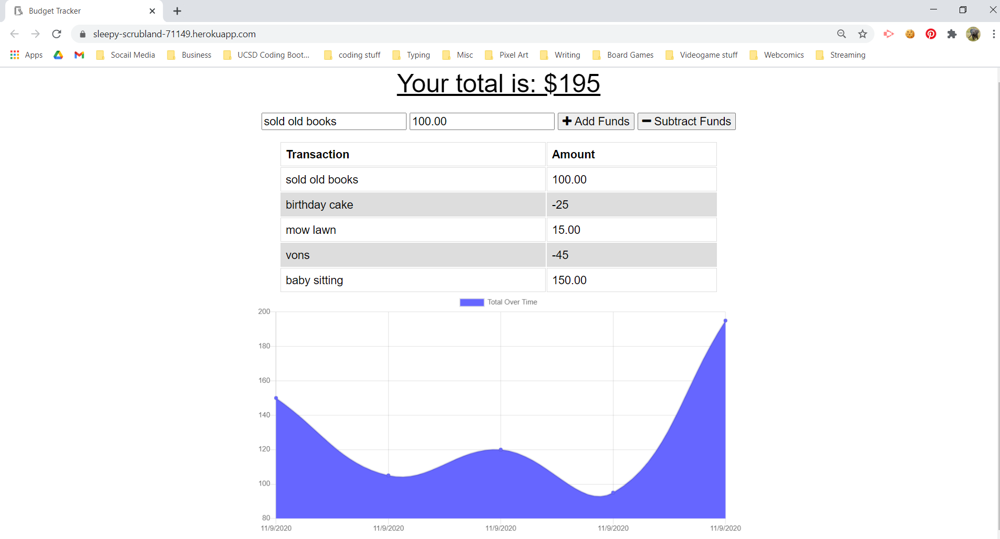

# Budget Tracker
Bootcamp week 18 HW

## Description

[Deployed app on Heroku](https://sleepy-scrubland-71149.herokuapp.com/)

This is a budget tracker provided by Triology Education, meant to be eddited into a PWA (progressive web app). 

## Installation

You can use this app in the browser or install it onto your device as a progressive web app.

[How to install a progressive web app](https://support.google.com/chrome/answer/9658361?co=GENIE.Platform%3DDesktop&hl=en)

## Usage

This app is for educational perposes only. Please do not enter your actual information.

## Credits

 * [Original app (without PWA integration) by Trinity Education](https://ucsd.bootcampcontent.com/UCSD-Coding-Bootcamp/ucsd-sd-fsf-pt-06-2020-u-c)
 * [How to Make a Progressive Web App from Your Existing Website by Christine Dodrill](https://blog.heroku.com/how-to-make-progressive-web-app)
 * [How to turn Your Website into a PWA (with code examples) by Jon Price](https://www.c2experience.com/blog/how-to-turn-your-website-into-a-pwa-with-code-examples)
 * [Activity 14 from week 18 code was referenced](https://ucsd.bootcampcontent.com/UCSD-Coding-Bootcamp/ucsd-sd-fsf-pt-06-2020-u-c)

## License

MIT 2020.